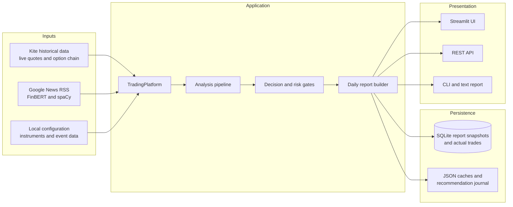
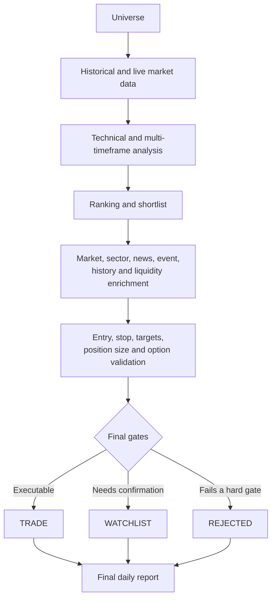
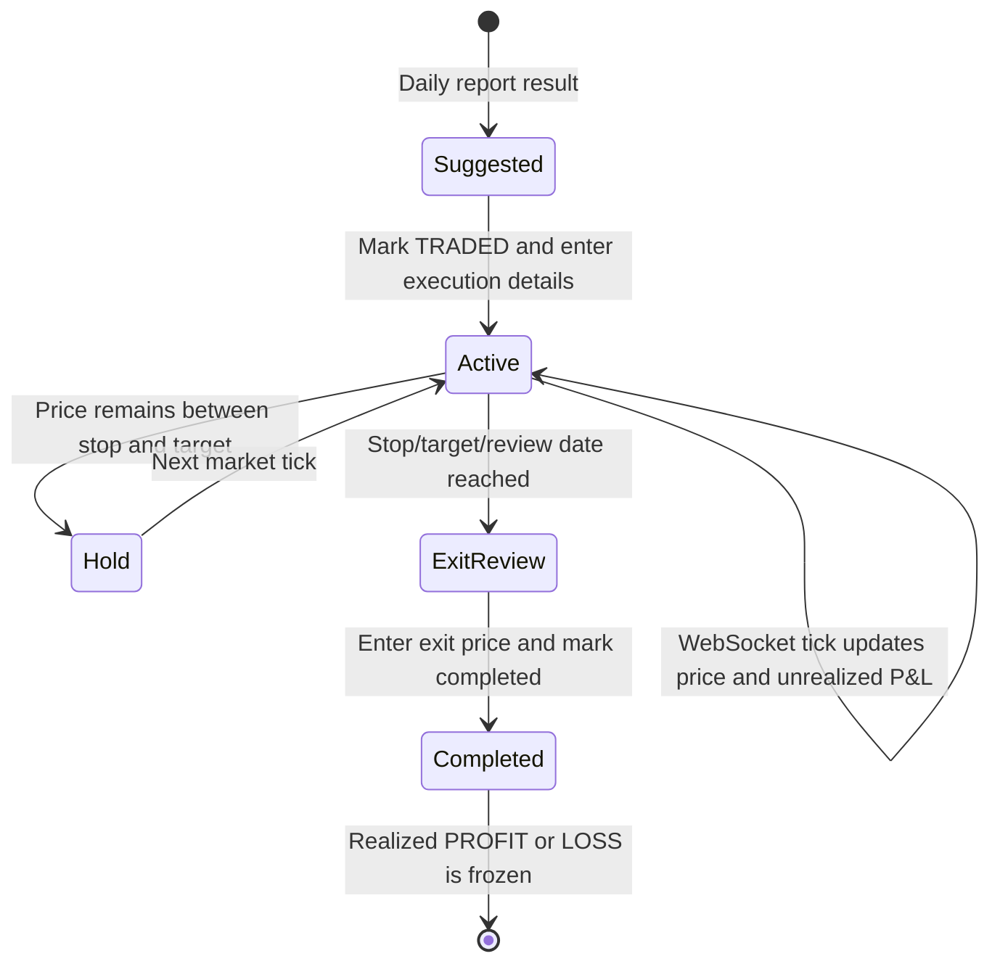

# AI Quantitative Trading Platform

An analysis-first trading platform for NSE equities. It uses Zerodha Kite for
historical OHLCV and live quotes, then provides technical analysis, trade
planning, backtesting, and a stateful paper-trading workflow.
Live order placement is intentionally not exposed by the public platform API.

## Quick start

Configure a valid daily Zerodha Kite access token in `.env`, then run:

```env
KITE_API_KEY=your_kite_api_key
KITE_ACCESS_TOKEN=your_daily_access_token
```

```bash
.venv/bin/python main.py analyze RELIANCE
.venv/bin/python main.py suggest --limit 5
.venv/bin/python main.py daily-report --limit 5
.venv/bin/python main.py backtest RELIANCE
.venv/bin/python main.py papertrade RELIANCE BUY --quantity 10
.venv/bin/python main.py portfolio
```

Each `daily-report` run deletes the previous `reports/daily_report.log`, then
writes both runtime messages and the complete final report to a fresh file.
Use `--log-file PATH` to choose another location. To restrict all option-chain
lookups to one expiry month, pass the month in `YYYY-MM` form:

```bash
.venv/bin/python main.py daily-report --limit 5 --option-month 2026-08
```

Without `--option-month`, expiry selection retains its normal automatic
nearest-expiry behavior. The REST endpoint supports the same filter through
`GET /daily-report?option_month=2026-08`.

Runtime defaults can be configured without changing source code:

```bash
export TRADING_CAPITAL=100000
export TRADING_RISK_PERCENT=1
export MARKET_DATA_SOURCE=kite
export OPTION_CAPITAL=2500000
export OPTION_RISK_PER_TRADE=100000
```

## Application API

`TradingPlatform` is the supported integration point for scripts and services:

```python
from src.application import TradingPlatform

platform = TradingPlatform()
suggestions = platform.suggest_stocks(limit=5)
report = platform.analyze("RELIANCE")
backtest = platform.backtest("RELIANCE")
order = platform.paper_trade("RELIANCE", "BUY", quantity=10)
```

Start with `suggest_stocks()` to rank the configured market universe. Candidates
are filtered to actionable BUY, BUY ON DIP, or WATCH setups and include a trade
plan and suggested risk-based quantity. It normalizes symbols, validates
orders, calculates a position size from the configured capital/risk limit, and
raises clear application errors when data is unavailable or input is invalid.

## REST API

Install the dependencies, then start the API:

```bash
.venv/bin/pip install -r requirements.txt
.venv/bin/python -m spacy download en_core_web_sm
.venv/bin/uvicorn src.api:app --reload
```

News analysis runs locally without a paid API. FinBERT classifies each
headline and description as positive, negative, or neutral, while spaCy
extracts named entities such as companies, people, and locations. The first
live analysis downloads `ProsusAI/finbert` from Hugging Face and caches it;
subsequent analyses reuse the local model. Override the defaults with
`NEWS_FINBERT_MODEL` and `NEWS_SPACY_MODEL` if required.

Available endpoints are `GET /health`, `GET /suggestions`, `GET /daily-report`, `POST /analyze`, `POST /backtest`,
`POST /papertrade`, `POST /outcomes`, and `GET /portfolio`. Request bodies for the first two are
`{"symbol": "RELIANCE"}`; paper trading also accepts `side` and optional
`quantity`.

`MARKET_DATA_SOURCE=cache` is available only as an explicit offline fallback
for development; it is not the default.

The local instrument file is used only to map a symbol such as `RELIANCE` to
Kite's instrument token. Candle/price data used in analysis comes from Kite on
each request.

This project is for research and paper trading. It does not constitute
investment advice.

## Windows 10 local UI

The local interface uses Streamlit and stores generated report snapshots in
SQLite at `data/ui/stock_analyzer.db`. Analytical decisions still come only
from `TradingPlatform`; the UI does not duplicate scoring logic or expose live
order submission.

1. Install 64-bit Python 3.12 and select **Add Python to PATH** during setup.
2. Open Command Prompt in the project directory.
3. Run `setup_windows.bat` once.
4. Copy `.env.example` to `.env` and enter the current Kite API key and daily
   access token. Never commit this file.
5. Double-click `run_ui.bat`, or run it from Command Prompt.
6. Open `http://localhost:8501` if the browser does not open automatically.

For an offline demonstration, set `MARKET_DATA_SOURCE=cache` in `.env`. Cache
mode cannot provide live relative strength, sector indices, news, quotes, or
option-chain validation and reports those inputs as unavailable.

The UI provides:

- a summary dashboard and recent report history;
- end-to-end daily report generation with configurable limit and minimum score;
- candidate, rejected-candidate, context, dependency-health, text, and JSON views;
- single-symbol analysis;
- SQLite-backed immutable report snapshots and downloadable JSON.
- a report-grounded AI Analyst that can explain the current candidate, risk, and safe project source;
- a guarded Codex Developer workspace with read-only explain/propose modes and an explicitly
  confirmed implementation mode;
- a read-only MCP server exposing the same candidate and project-context tools.

## AI Analyst, MCP, and Codex

Add an OpenAI API key to `.env` to enable the AI Analyst in Streamlit:

```env
OPENAI_API_KEY=your_openai_api_key
OPENAI_ANALYST_MODEL=gpt-5.6-terra
```

The key remains server-side. Assistant context excludes `.env`, credentials, `.git`, caches,
market-data files, and arbitrary filesystem paths. The analyst reads saved report snapshots and
bounded safe source snippets; it cannot place orders or change analytical decisions.

Run the same read-only tools as an MCP server over standard input:

```bash
.venv/bin/python run_mcp.py --transport stdio
```

For a ChatGPT developer-mode app, run the streamable HTTP transport behind an authenticated HTTPS
endpoint or secure development tunnel:

```bash
.venv/bin/python run_mcp.py --transport streamable-http
```

The Streamlit Codex workspace requires an installed and authenticated Codex CLI on the server.
Set `CODEX_EXECUTABLE` only when it is not available as `codex` on `PATH`. Its modes are:

```bash
npm install -g @openai/codex
codex login
```

- `EXPLAIN`: read-only inspection and explanation;
- `PROPOSE`: read-only diagnosis and patch plan;
- `IMPLEMENT`: repository writes only after an explicit UI confirmation.

Codex is instructed not to read secrets, place trades, push, deploy, install dependencies, or use
network access. Review the Git diff and test result after every implementation run. Keep this
developer workspace private; do not expose it as a public unauthenticated page.

To stop the UI, close its Command Prompt window or press `Ctrl+C`.

The UI disables Streamlit's Python module watcher because Hugging Face
Transformers exposes optional computer-vision modules that reference
`torchvision`. The project uses text-only FinBERT and does not require
`torchvision`; disabling the watcher prevents misleading `ModuleNotFoundError:
torchvision` messages without installing an unrelated vision stack.

## Architecture and data flow

The application is split into four layers. `TradingPlatform` is the supported
facade between the UI/API and the analytical code, so Streamlit only presents
results and records user actions; it does not make independent trading
decisions.



### Daily analysis pipeline

A daily report follows this sequence:

1. Load the configured NSE/F&O universe and obtain historical OHLCV data.
2. Calculate technical indicators, trend, momentum, volatility, volume,
   support/resistance, candlestick evidence, and relative strength.
3. Rank the universe and shortlist the strongest candidates for deeper review.
4. Enrich shortlisted stocks with market regime, sector strength, news
   sentiment, event risk, historical behaviour, and liquidity evidence.
5. Build an equity trade plan containing entry, stop-loss, targets,
   risk/reward, and risk-based position size.
6. When Kite option data is enabled, validate expiry, strikes, liquidity,
   structure, pricing, and final option approval.
7. Apply final quality and execution-readiness gates. Each candidate is placed
   in `trades`, `watchlist`, or `rejected`; the system never forces a trade to
   satisfy the requested limit.
8. Save the complete immutable report JSON to SQLite and present the same
   result through Streamlit, REST, CLI text, and downloadable JSON.



### Suggested trade and live-position lifecycle

Marking a stock as traded from its suggestion card creates an `actual_trades`
record immediately. The user supplies the actual entry price, quantity, trade
date, and hold/review date; the report's stop-loss and first target are copied
into the tracked position. No second entry in Trade Tracker is required.

In Kite mode, one shared `KiteTicker` WebSocket subscribes to the instrument
tokens for all active equity positions. Incoming ticks are stored in a
thread-safe in-memory cache. The Streamlit fragment redraws once per second
from that cache, without requesting a quote on every redraw. If the WebSocket
is connecting or unavailable, a rate-limited REST quote provides the fallback.
Completing a position removes it from active subscriptions and freezes its
realized P&L.



### How final results are displayed

| Result | Where it appears | What is shown |
|---|---|---|
| Daily summary | Dashboard and Daily report | Stocks scanned, candidates reviewed, generated trades, watchlist count, and market regime |
| Executable candidate | Daily report → Candidates | Final action, quality, readiness, entry, stop-loss, targets, risk/reward, and approved option structure when available |
| Watchlist or rejected candidate | Daily report → Candidates/Rejected | Current analytical status and the reasons or confirmation gates that prevented execution |
| Active position | Daily report and Trade Tracker → Live Positions | WebSocket price, live P&L in rupees and percent, PROFIT/LOSS state, stop/target distance, HOLD/EXIT guidance, hold-until date, and latest tick time |
| Completed position | Suggestion card and Trade Tracker history | Exit date, exit price, fees, final realized P&L, and final PROFIT or LOSS outcome |
| Full audit result | History, text, and JSON tabs | Immutable input context, scores, evidence, rejection reasons, dependency health, and the complete report payload |

The live UI is advisory and journal-oriented. `HOLD`, `EXIT`, `BOOK PROFIT`,
and `REVIEW` describe the stored trade plan relative to the latest price; they
do not submit, modify, or close an order at Zerodha. A trade becomes completed
only when the user records its exit in the UI.

## Daily recommendation report

`daily-report` is the end-to-end output: it scans the configured universe,
risk-reviews the top 20 ranked candidates, generates entry/stop/target/position
size details, enriches finalists with live option-chain intelligence when Kite
is enabled, and prints a market summary. Add `--json` for the equivalent
machine-readable report. It never submits live orders.

For live Kite reports, Google News RSS is collected only for shortlisted
stocks. FinBERT sentiment adjusts the unified score and estimated probability,
and the report includes source headlines plus spaCy entities. The system does
not fall back to hard-coded positive/negative keyword lists when local models
are unavailable. Cache mode intentionally does not fetch external news.

The reported probability is a documented heuristic until it has been
calibrated with recorded out-of-sample trade outcomes; it is not a promise of
performance.

Each daily recommendation receives a `recommendation_id`. After closing the
paper trade, record the result with `main.py record-outcome ID WIN` (optionally
add `--return-percent`, `--exit-price`, `--mfe-percent`, and `--mae-percent`).
The outcome store also records the predicted probability, entry, stop, targets,
readiness, expected value, probability error, and Brier score. Once at least 20 completed outcomes exist for a
strategy, the report blends its observed win rate into the estimated
probability; 200 outcomes is the report's validation milestone.

Setup quality and execution readiness are independent. Quality uses technical
score 25%, trend/momentum 20%, relative strength 15%, reward/risk 15%, expected
value 10%, probability 10%, and liquidity/trust 5%; market, news, options,
sector availability, and entry timing cannot lower that grade. Readiness uses
execution/context evidence and modest regime-specific execute thresholds.
Historical checks remain neutral until `CALIBRATION_MIN_OUTCOMES` (default 200).
Candidate ordering defaults to expected value and can be changed with
`CANDIDATE_RANKING_MODE=EXPECTED_VALUE|QUALITY_SCORE|AI_SCORE|READINESS`.
The daily report risk-reviews the top 20 ranked stocks by default, independently
of the final trade `--limit`. Override this with `RANKING_SHORTLIST_SIZE` (1–30).
Equity setups use confidence-aware reward/risk floors: A-grade 1.5
(`EQUITY_MIN_RISK_REWARD`), B-grade 1.3
(`EQUITY_B_GRADE_MIN_RISK_REWARD`), and watchlist/C-grade 1.2
(`EQUITY_WATCHLIST_MIN_RISK_REWARD`).

### Event risk

The daily workflow builds one shared event context, then assesses company,
scheduled-calendar, commodity, macro, geopolitical, sector, and market-wide
risk for every finalist. Event risk never changes technical or quality scores.
It retains base readiness/probability/position size and reports separately
adjusted readiness, probability, event size multiplier, overnight eligibility,
strategy restrictions, matched events, freshness, and decay.

Cached inputs live under `data/cache/events/`: `events.json`,
`company_calendar.json`, `economic_calendar.json`, `commodity_snapshot.json`,
and `manual_overrides.json`. Each uses an `events` array except the commodity
snapshot. Manual events support `enabled`, `expiry_time`, `reason`,
`created_by`, and `test_only`; test-only overrides require
`EVENT_ALLOW_TEST_OVERRIDES=true`. Writes made through `EventRepository` are
atomic and schema-versioned.

Important settings include `EVENT_RISK_ENABLED`, `CRUDE_DAILY_MOVE_WARNING`,
`CRUDE_DAILY_MOVE_HIGH`, `CRUDE_DAILY_MOVE_EXTREME`,
`COMMODITY_ZSCORE_HIGH`, `COMMODITY_ZSCORE_EXTREME`, event position
multipliers, freshness penalties, half-lives, hard-block scores, and
`EVENT_DEFINED_RISK_OPTIONS_ONLY_AT_HIGH`. Company and sector exposure
coefficients are maintained in `resources/event_risk_config.json`.

Sector coverage is enforced by tests: every symbol in the cached F&O universe
must have an explicit entry in `resources/sector_mapping.csv`, and every mapped
sector must have an event-sensitivity profile. The current matrix maps all 210
cached symbols across 38 active sectors and contains 45 profiles including
aviation, chemicals, shipping, logistics, real estate, tyres, textiles,
telecom, insurance, exchanges, fintech, defence, hospitality, restaurants,
renewables, mining, electronics, apparel, beverages, and asset management.
Company-type overrides handle materially different businesses within the same
sector, such as upstream versus oil marketing and renewable versus thermal
power.
